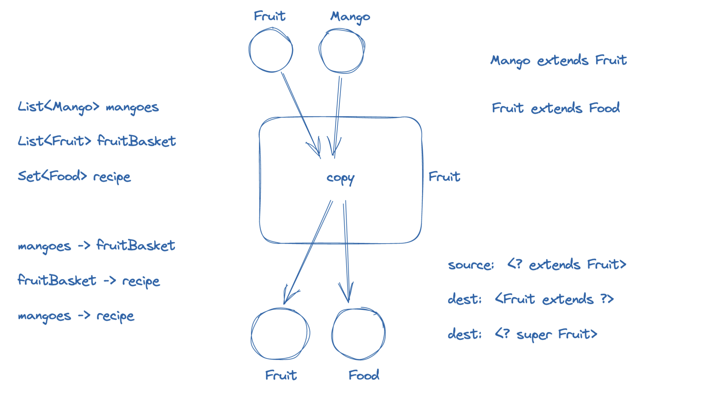

Variance

Covariance, Contravariance, Invariance


f(x) = 10x


x1 > x2   =>  f(x1) > f(x2)


g(x) = 1/x

x1 > x2 =>   g(x1)  < g(x2)

k(x) = 1 - x

x1 > x2 =>   k(x1) ?? k(x2)			invariance


for f(x) ">" and "<" are covariant

for g(x) "<" and ">" are contravariant

======================================================

B extends A

```
List<B> ?? List<A> 			invariant
```
"generic covaraint wildcarded type" -> "? extends E"


B extends A
```
List<? extends A> extend List<A>
```
i.e.

`List<B>` can be passed where `List<? extends A>` is needed
`List<B>` can NOT be passed where `List<A>` is needed





